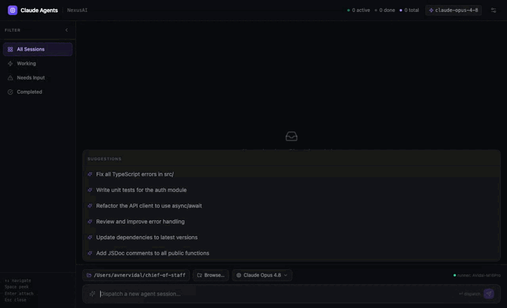

# NexusAI

**A local-first control panel for Claude Code agents.** Dispatch coding tasks, watch
agents work in real time, review their file changes, and steer them — all running
entirely on your own machine. No cloud, no account, no sign-in.

> One process serves the dashboard, stores everything in a local SQLite file, runs the
> agents on your machine, and opens your browser. That's it.



---

## Features

- **Dispatch agents** to any folder on your machine, pick the model per task.
- **Live session view** — every tool call and message streamed as it happens.
- **Real file diffs** — see exactly what the agent changed (via git), side by side.
- **Continue conversations** — reply to a finished session and it resumes where it left off.
- **Stop** a running agent mid-flight.
- **Native folder picker** — Browse… opens your real OS file dialog.
- **Local & private** — data lives in `~/.nexus/nexus.db`; nothing leaves your machine.

## Requirements

- **Node.js ≥ 22.5** (uses the built-in `node:sqlite`).
- An agent backend, either:
  - **[Claude Code](https://docs.claude.com/claude-code)** installed and logged in
    (works with a Claude Pro / Max / Team subscription) — the default, no API key; **or**
  - an **`ANTHROPIC_API_KEY`** (set `NEXUS_EXECUTOR=claude`).

## Quick start

The fastest way (once published to npm):

```sh
npx nexusai
```

Or from source:

```sh
git clone https://github.com/avidala/nexusai.git
cd nexusai
npm install
npm run build
npm start
```

Either way, the server starts on `http://localhost:4317` and opens your browser.
Pick a folder, type a task, and dispatch.

## Development

Two terminals — the UI with hot reload, and the API server:

```sh
npm run dev          # dashboard (vite) on http://localhost:5173, proxies /api
npm run dev:server   # the local server/API on :4317
```

## Configuration

All optional, via environment variables:

| Variable             | Default                | What it does                                            |
| -------------------- | ---------------------- | ------------------------------------------------------- |
| `PORT`               | `4317`                 | Server port                                             |
| `NEXUS_EXECUTOR`     | `claude-code`          | `claude-code` (subscription) · `claude` (API key) · `mock` |
| `ANTHROPIC_API_KEY`  | —                      | Required for `NEXUS_EXECUTOR=claude`                    |
| `NEXUS_FOLDER_ROOTS` | `$HOME` + common dirs  | Colon-separated roots to scan for project folders       |
| `NEXUS_DB`           | `~/.nexus/nexus.db`    | SQLite database location                                |
| `NEXUS_NO_OPEN`      | —                      | Set to skip auto-opening the browser                    |

## How it works

```
  browser (dashboard)
        │  REST + Server-Sent Events
        ▼
  local server (this machine)
   ├─ SQLite store  (~/.nexus/nexus.db)
   ├─ runs Claude Code agents in your chosen folder
   └─ serves the built dashboard
```

The dashboard talks only to `localhost`. Agents run as real Claude Code sessions on
your machine, so they use your local tools and your repos directly.

> ⚠️ Agents run with file and shell access in the folder you choose. Point them at
> repositories you're comfortable letting an agent modify.

## License

[MIT](./LICENSE) © Avner Vidal
